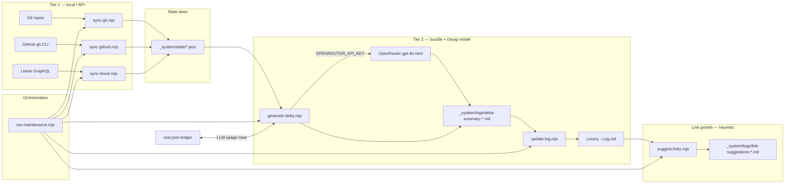

# Lexery - Automation Architecture

## Design principles

- **Delta-first:** never rescan entire repos; only process new changes.
- **Tiered AI:** pure logic → cheap model → premium model.
- **State-tracked:** every processed commit, PR, and issue has a hash or cursor in the state store.
- **Conservative:** never destroy manually curated content; only append or patch.
- **No jq:** automation runs on **Node.js** (native `fetch` on v18+); shell is limited to optional LaunchAgent install helpers.

## Architecture

## Scripts (`_system/scripts/`)

| Script | Role | Status |
|--------|------|--------|
| `sync-git.mjs` | Scan tracked repos (see `repos.json`), write `git-digest-YYYYMMDD.md`, update SHAs | **implemented** |
| `sync-github.mjs` | List PRs via `gh`, write `github-digest-YYYYMMDD.md`, advance `prs.json` | **implemented** (requires `gh`) |
| `sync-linear.mjs` | Pull recent issues via Linear GraphQL when `LINEAR_API_KEY` is set | **implemented** (optional key) |
| `generate-delta.mjs` | Bundle today’s digests (fallback: last 7 days), optional OpenRouter summary, append `cost.json` | **implemented** |
| `update-log.mjs` | Prepend latest delta into `Lexery - Log.md` after the title | **implemented** |
| `suggest-links.mjs` | Heuristic link ideas (tags, layer, adjacent U-stages, unlinked title mentions) → `link-suggestions-YYYYMMDD.md` | **implemented** |
| `run-maintenance.mjs` | Runs the full cycle in order; writes `maintenance-YYYYMMDD.md` | **implemented** |
| `install-schedule.sh` | Symlink plist → `~/Library/LaunchAgents/` and `launchctl load` | **implemented** |
| `uninstall-schedule.sh` | `launchctl unload` and remove the agent plist link | **implemented** |

**Planned / not in repo yet**

| Piece | Status |
|-------|--------|
| `sources.json` + content-hash ingestion registry | **planned** |
| Automated wiki body patches (beyond log prepend) | **planned** |
| Drift detector → [[Lexery - Drift Radar]] refresh | **planned** |
| Tier 3 scheduled full consistency audit | **planned** |
| GitHub sync without `gh` (REST + token) | **planned** |

## State store (`_system/state/`)

- `repos.json` — tracked repos with last-processed commit SHA (**implemented**).
- `prs.json` — per-remote `last_processed_pr` (**implemented**).
- `issues.json` — Linear cursor + optional `recent_snapshot` (**implemented** when Linear runs).
- `sources.json` — all ingested source files with content hashes (**planned** — file not present yet).
- `cost.json` — running AI cost totals (**implemented**; updated when OpenRouter path runs).

## Triggers

- **Daily (launchd):** `com.lexery.wiki-maintenance` at 08:00 runs `run-maintenance.mjs` — plist: `_system/com.lexery.wiki-maintenance.plist` (**implemented**; install via `install-schedule.sh`).
- **Ad hoc:** run `node _system/scripts/run-maintenance.mjs` from anywhere, or individual `.mjs` steps.
- **Env-gated steps:** `OPENROUTER_API_KEY` (LLM summary), `LINEAR_API_KEY` (issues); missing keys log a skip, not a hard failure of the whole cycle.

## Links

[[Lexery - Maintenance Runbook]], [[Lexery - Cost Ledger]], [[Lexery - Source Registry]], [[Lexery - Drift Radar]], [[Lexery - Log]], [[Lexery - Index]], [[Lexery - Provider Topology]], [[Lexery - Brain Architecture]]
