---
aliases:
  - Lexery Brain
  - Lexery Project Brain
tags:
  - lexery
  - project-brain
  - compiled-wiki
  - obsidian
created: 2026-04-09
updated: 2026-04-09
source_mode: compiled
status: observed
layer: meta
---

> [!info] Compiled from
> - `raw/architecture-docs/app-README.md`
> - `raw/architecture-docs/LEXERY_LEGAL_AI_AGENT_ARCHITECTURE.md`
> - Codebase analysis and session synthesis

![[logo-brand.png|300]]

# Lexery — Project Brain

> [!important]
> **Lexery — другий мозок стартапу.**
> Ця вікі працює як живий compiled knowledge artifact у стилі [Karpathy LLM Wiki](https://gist.github.com/karpathy/442a6bf555914893e9891c11519de94f). Сирі джерела (код, GitHub, Linear, docs) залишаються source of truth. Вікі — це persistent synthesis layer, який зростає з кожним комітом, кожним PR, кожним рішенням.

> [!tip] Як користуватися
> - Почни з **навігації нижче** або відкрий [[Lexery - Master Map.canvas|🗺️ Master Map Canvas]]
> - Для пошуку термінів → [[Lexery - Glossary|📖 Глосарій]]
> - Для перегляду змін → [[Lexery - Log|📋 Лог]]
> - Для перевірки суперечностей → [[Lexery - Drift Radar|⚠️ Drift Radar]]

> [!abstract] 🧠 Brain & Runtime
> - [[Lexery - Brain Architecture]] — архітектура Legal Agent
> - [[Lexery - ORCH and Clarification]] — оркестрація, pause/resume
> - [[Lexery - U1-U12 Runtime]] — повний pipeline
> - [[Lexery - Public Trace]] — execution trace API
> - [[Lexery - Run Lifecycle]] — стани і переходи run
> - [[Lexery - Coverage Gap Honesty]] — чесність при відсутності evidence
> - [[Lexery - Retry and Recovery]] — retry контракти
> - [[Lexery - Pipeline Health Dashboard]] — зведені метрики pipeline та funnel

> [!example] 🗄️ Data & Retrieval
> - [[Lexery - Retrieval, LLDBI, DocList]] — retrieval plane
> - [[Lexery - LLDBI Surface]] — Qdrant legislation index
> - [[Lexery - DocList Surface]] — Rada catalog resolver
> - [[Lexery - Import Proposal Loop]] — Brain→LLDBI import pipeline
> - [[Lexery - Memory and Documents]] — memory manager
> - [[Lexery - Provider Topology]] — зовнішні сервіси
> - [[Lexery - Storage Topology]] — data stores

> [!success] 📊 Product & Business
> - [[Lexery - Product Surface]] — продуктова оболонка
> - [[Lexery - Portal Surface Map]] — `apps/portal` inventory
> - [[Lexery - API and Control Plane]] — NestJS backend
> - [[Lexery - Contracts and Run Schema]] — shared contracts
> - [[Lexery - Business Model]] — pricing, plans, monetization
> - [[Lexery - Current State]] — observed стан на сьогодні
> - [[Lexery - Branch Divergence]] — розбіжність гілок
> - [[Lexery - Technology Stack]] — runtime, AI, storage, monorepo, infra

> [!info] 🕐 History & Evolution
> - [[Lexery - Timeline]] — хронологія від beta до monorepo
> - [[Lexery - Idea Evolution]] — трансформація ідеї
> - [[Lexery - Naming Evolution]] — Mike Ross → Lexory → Lexery
> - [[Lexery - Legacy Beta App]] — перший продукт
> - [[Lexery - Legacy Architecture Bridge]] — bridge repo
> - [[Lexery - Legacy Branch Families]] — гілки-предки
> - [[Lexery - Corpus Evolution]] — еволюція корпусу
> - [[Lexery - Frontend and Brand Evolution]] — UI та бренд
> - [[Lexery - GitHub History]] — PR, branch, contributors

> [!warning] 👥 Team & Operations
> - [[Lexery - Team and Operating Model]] — модель роботи
> - [[Lexery - Andrii Serediuk]] — founder, Brain owner
> - [[Lexery - Yehor Puhach]] — backend engineer
> - [[Lexery - Olexandr]] — frontend engineer
> - [[Lexery - Linear Roadmap]] — Linear projects/issues
> - [[Lexery - PR Chronology]] — хронологія pull requests
> - [[Lexery - Who Built What]] — мапа контрибуцій по людях і доменах

> [!danger] 🛡️ Governance & Meta
> - [[Lexery - Decision Registry]] — реєстр рішень
> - [[Lexery - Glossary]] — глосарій термінів
> - [[Lexery - Drift Radar]] — активні суперечності
> - [[Lexery - Unknowns Queue]] — відкриті питання
> - [[Lexery - Open Questions and Drift]] — drift & risks
> - [[Lexery - Source Registry]] — реєстр джерел
> - [[Lexery - Source Map]] — ієрархія довіри
> - [[Lexery - Maintenance Runbook]] — runbook вікі
> - [[Lexery - Automation Architecture]] — self-maintenance
> - [[Lexery - Cost Ledger]] — бюджет AI

## 🔄 Останні зміни

> [!note] Останній ingest: 2026-04-09
> Додано 21 нову сторінку, 3 нових canvas, automation layer, 100% frontmatter coverage.
> Див. [[Lexery - Log]] для повної хронології.

## 🗺️ Visual Maps

| Canvas | Що показує |
|--------|-----------|
| [[Lexery - Master Map.canvas\|🌐 Master Map]] | Повна топологія wiki |
| [[Lexery - Runtime Graph.canvas\|🧠 Runtime Graph]] | U1-U12 pipeline |
| [[Lexery - Product Graph.canvas\|📊 Product Graph]] | Продукт і бізнес |
| [[Lexery - History Graph.canvas\|🕐 History Graph]] | Еволюція ідеї |
| [[Lexery - Infrastructure Graph.canvas\|⚙️ Infrastructure]] | Провайдери і storage |
| [[Lexery - Team Graph.canvas\|👥 Team Graph]] | Люди і ownership |
| [[Lexery - Branch Lineage.canvas\|🌿 Branch Lineage]] | Репо і гілки |

### Як організована вікі

- `History layer`:
  `[[Lexery - Timeline]]`, `[[Lexery - Idea Evolution]]`, `[[Lexery - Legacy Beta App]]`, `[[Lexery - Legacy Architecture Bridge]]`, `[[Lexery - Legacy Branch Families]]`, `[[Lexery - Corpus Evolution]]`, `[[Lexery - Frontend and Brand Evolution]]`
- `System layer`:
  `[[Lexery - Brain Architecture]]`, `[[Lexery - ORCH and Clarification]]`, `[[Lexery - U1-U12 Runtime]]`, `[[Lexery - Retrieval, LLDBI, DocList]]`, `[[Lexery - Memory and Documents]]`, `[[Lexery - Deployment and Infra]]`
- `Product layer`:
  `[[Lexery - Product Surface]]`, `[[Lexery - API and Control Plane]]`, `[[Lexery - Business Model]]`, `[[Lexery - Current State]]`, `[[Lexery - Branch Divergence]]`
- `Operating layer`:
  `[[Lexery - Repo Constellation]]`, `[[Lexery - Team and Operating Model]]`, `[[Lexery - Linear Roadmap]]`, `[[Lexery - GitHub History]]`, `[[Lexery - Open Questions and Drift]]`
- `Evidence layer`:
  `[[Lexery - Source Map]]`, `[[Lexery - Index]]`, `[[Lexery - Log]]`

### Ментальна карта

```mermaid
graph TD
    A["Lexery"] --> B["History"]
    A --> C["Product"]
    A --> D["Brain"]
    A --> E["Infra"]
    A --> F["Operating model"]
    A --> G["Evidence / sources"]
    B --> B1["Timeline"]
    B --> B2["Idea evolution"]
    B --> B3["Legacy beta"]
    B --> B4["Legacy architecture bridge"]
    C --> C1["Portal + API"]
    C --> C2["Business model"]
    C --> C3["Current state"]
    C --> C4["Branch divergence"]
    D --> D1["Brain architecture"]
    D --> D2["U1-U12 runtime"]
    D --> D3["Retrieval + LLDBI + DocList"]
    D --> D4["Memory + docs"]
    E --> E1["Deployment"]
    E --> E2["Cloudflare / Supabase / Qdrant / R2"]
    F --> F1["Repo constellation"]
    F --> F2["Team"]
    F --> F3["Linear roadmap"]
    G --> G1["Source map"]
    G --> G2["Open questions / drift"]
```

> [!summary]
> Це compiled knowledge note по Lexery у стилі karpathy `LLM Wiki`: не сирий RAG-дамп, а зведений "мозок" проєкту, зібраний з локального коду, локальних docs/memory notes, git-історії, GitHub-стану і окремих архітектурних документів.  
> Принцип такий самий, як у [LLM Wiki від Andrej Karpathy](https://gist.github.com/karpathy/442a6bf555914893e9891c11519de94f): raw sources лишаються джерелом правди, а ця note є compiled persistent synthesis, яка накопичує зв'язки, суперечності й актуальні висновки.

> [!info]
> Стан знято **9 квітня 2026** з:
> - локального репо `__PATH_LEXERY_MONOREPO__`
> - GitHub repo `https://github.com/lexeryAI/Lexery`
> - поточної локальної гілки `legal-agent-brain-dev`
> - remote default branch `dev`
> - локального Obsidian vault `/Users/andriyseredyuk/Documents/Obsidian Vault`

## Як читати цю note

- `Observed` = підтверджено реальним кодом, git-станом або GitHub API.
- `Inferred` = обережний висновок із кількох джерел.
- `Planned` = є в docs/ADR/архітектурних нотах, але не повністю підтверджено live-кодом.
- `Drift` = різні джерела суперечать одне одному; такі місця тут спеціально винесені, а не замазані.

---

## 1. Lexery в одному великому блоці

`Lexery` зараз виглядає як **український AI legal/workspace SaaS**, який фактично складається з двох великих ліній розвитку.

Перша лінія, найглибша технічно, це `apps/brain` плюс `apps/lldbi` і вся DocList/LLDBI інфраструктура. Це не просто "чат з LLM", а вже досить серйозний багатостадійний legal runtime: `U1 -> U12`, де є gateway, класифікація, планування, retrieval, gate, bounded orchestration, evidence/reasoning, assemble, write, verify, deliver, а також MM memory і MM Docs. Ця лінія мислиться як **керований legal operating loop**, а не один великий black-box prompt. Тут головна ставка зроблена на контрольований state machine, retrieval-first legal grounding, чесну роботу з coverage gaps, bounded clarification, Redis-backed durable queue/context, Supabase, Qdrant, R2 і окрему corpus-maintenance площину через LLDBI admin.

Друга лінія, більш продуктова й UI-oriented, це `apps/portal` плюс `apps/api`. Вона описує Lexery як **workspace product** для українського ринку, ближчий до ChatGPT/Perplexity-style AI workspace, але з multi-tenant control plane, auth, workspaces, feature flags, presigned uploads і plan-based access. На GitHub ця гілка рухається через `dev`: там уже є фронтенд на Next.js 16 / React 19, auth flow, subscription-plan UI, workspace shell, streaming chat API routes і певна підготовка під email/sms/oauth auth. Водночас локальна основна brain-робота сидить в окремій гілці `legal-agent-brain-dev` і ще не інтегрована у `dev`.

Коротко: **Lexery = legal brain + product control plane + workspace frontend + legislation corpus infrastructure**, але ці частини ще не повністю зведені в одну стабільну mainline. Проєкт дуже молодий, дуже швидко рухається, і зараз головний реальний центр ваги — це `apps/brain`.

---

## 2. Найбільш надійна картина стану прямо зараз

### Repo snapshot

- `Observed`: монорепо на `pnpm` + `turbo`.
- `Observed`: root package name — `lexery-monorepo`.
- `Observed`: локально репо має приблизно:
  - `1117` файлів через `rg --files`
  - `1154` tracked files через `git ls-files`
  - `62` git commits у локальній історії
  - часовий діапазон локальної git-історії: **2026-03-26 -> 2026-04-09**

### Гілки

- `Observed`: GitHub repo private, створений **2026-03-13**, default branch — `dev`.
- `Observed`: локально є 2 основні гілки:
  - `dev`
  - `legal-agent-brain-dev`
- `Observed`: після `git fetch origin --prune`:
  - локальна `dev` відстає від `origin/dev` на **21 коміт**
  - локальна `legal-agent-brain-dev` випереджає `origin/legal-agent-brain-dev` на **9 комітів**
  - `HEAD` (`legal-agent-brain-dev`) відносно `origin/dev` має розрив **25 локальних vs 21 remote** коміт

### Що це означає practically

- `Observed`: зараз існує **серйозний branch split** між product/UI evolution на `dev` і brain/runtime evolution на `legal-agent-brain-dev`.
- `Inferred`: це не просто короткий feature branch, а окрема архітектурна лінія, яка поки не злита в main product branch.
- `Observed`: локальний worktree брудний; велика частина незакомічених змін — у `apps/brain`.

### Поточний брудний локальний diff

Основні незакомічені локальні зміни сидять у:

- `apps/brain/doclist/*`
- `apps/brain/orchestrator/*`
- `apps/brain/retrieval/*`
- `apps/brain/write/*`
- `apps/brain/gateway/*`
- `apps/brain/docs/architecture/app/*`
- `apps/lldbi/brain-admin/*`
- `docs/lexery-testing-guide.md`

Нові untracked файли:

- `apps/brain/lib/redis-shared.ts`
- `apps/brain/tools/u4/test_query_rewrite_phase_units.ts`
- `apps/brain/tools/u6/test_doclist_lookup_units.ts`

Це дуже добре збігається з checkpoint і з локальною історією комітів за 8-9 квітня: Redis hardening, clarification race fix, ORCH cost cutting, DocList prioritization, retry reuse, LLDBI signals.

---

## 3. Еволюція проєкту

## 3.1. Дуже коротка історія

### Фаза A. Старт монорепо і foundation

- **2026-03-26** — `chore: create basic application skeleton and add docs files`
- **2026-03-27** — `feat: add basic monorepo structure and backend foundation`

На цій фазі формується monorepo, документація, backend foundation і загальна система.

### Фаза B. Product backend + frontend migration + legal-agent migration

- **2026-03-29**
  - `feat: implement database schema, native auth guard and JIT user provisioning`
  - `chore: migrate frontend and configurate it to use monorepo infrastructure`
  - `Migrate legal-agent scripts and docs into apps/brain`
- **2026-03-30**
  - `chore: finish legal agent monorepo migration`
  - `fix(brain): validate u10 docs-absence guard and cutover docs`
  - backend storage upload feature merge line

На цій фазі Lexery переходить від старих окремих workspace/repo станів до нового монорепо з `apps/brain`, `apps/api`, `apps/portal`, `apps/lldbi`.

### Фаза C. Retrieval hardening sprint

- **2026-04-02 -> 2026-04-07**
  - серія комітів про `multi-goal retrieval`, `compact bundles`, `coverage semantics`, `missing-act honesty`, `U2/U4 runtime hardening`

Це дуже виразний період, коли Lexery Brain концентрується на:

- LLDBI-first retrieval quality
- чесності при missing-act / weak-evidence сценаріях
- multi-goal legal questions
- natural legal prompts, а не тільки explicit citations

### Фаза D. Agentivity / bounded orchestration sprint

- **2026-04-08 -> 2026-04-09**
  - `Add bounded legal orchestrator and DocList recovery`
  - `Wire brain-admin to proposal queue and track ORCH telemetry`
  - `Add live agentivity audit harness`
  - `Tune bounded recovery and cut false clarification loops`
  - `Close bounded recovery rerun gap`
  - `Harden bounded recovery reruns and trim U9 tail latency`
  - `Harden clarification resume and ORCH decision telemetry`
  - `Cut deterministic ORCH cost and narrow clarification resume`

Це вже не migration, а **нова операційна модель Legal Agent**: ORCH, explicit U6/U7/U8, public trace, clarification pause/resume, DocList-assisted recovery, Brain -> LLDBI admin hints.

### Паралельна product/UI еволюція на `dev`

Поки Brain ішов у bounded agentivity, `dev` на GitHub рухався так:

- shared contracts package
- auth refactor
- auth flow screens
- адаптація backend user schema під frontend auth
- subscription plans UI
- refine sidebar/profile plan interactions
- open PR для email/sms/oauth registration infra

Тобто `dev` — це продуктова/UX/control-plane гілка, а `legal-agent-brain-dev` — це brain/runtime гілка.

---

## 4. Актуальний стан по гілках

## 4.1. `legal-agent-brain-dev`

Це найсильніша технічна гілка щодо Brain.

### Що тут already true

- `Observed`: bounded top-level orchestration (`ORCH`) live
- `Observed`: explicit recovery path (`U6`) live
- `Observed`: explicit `U7` evidence assembly live
- `Observed`: explicit `U8` legal reasoning live
- `Observed`: clarification pause/resume live
- `Observed`: public trace endpoint live
- `Observed`: Brain -> LLDBI admin signal bridge live
- `Observed`: Redis shared-client hardening + graceful shutdown already в локальному dirty tree / checkpoint

### Найважливіший технічний наратив цієї гілки

Lexery Brain перестає бути лінійним pipeline-only runtime і стає **bounded agentic legal system**, де:

- модулі лишаються окремими
- routing залишається контрольованим
- recovery не маскує stale state
- ORCH не витрачає LLM там, де policy already deterministic
- DocList лишається discovery plane, а не підміняє LLDBI

### Реально зафіксовані live покращення 9 квітня 2026

- `Observed`: `brain:verify:api-acceptance` повернувся в PASS після Redis hardening:
  - `accepted_202 = 10`
  - `status_5xx = 0`
  - `p50_latency_ms = 930`
- `Observed`: clarification race fixed:
  - fast answer більше не перезаписується назад у `pending`
- `Observed`: seeded U4 retry reuse зменшив повторну ціну rerun
- `Observed`: DocList exact-cue priority зняв timeout-heavy noise path
- `Observed`: deterministic ORCH tuning дав canary з `avg_orch_llm_calls = 0`

### Основний борг цієї гілки

- `Observed`: post-retrieval tail latency, особливо після `U4`
- `Observed`: `U10` answer quality / repair loop cost
- `Observed`: є open runtime gap:
  - search plan може позначити `explicit_act_title_probe`
  - але це не завжди materialize-иться в окрему pre-`U6` ambiguity branch

## 4.2. `origin/dev`

Це найактуальніша GitHub mainline продуктова гілка.

### Що там видно

- `Observed`: merged PR #10 `[Frontend] feat: subscription plans`
- `Observed`: merged auth refactor/auth screens work
- `Observed`: shared contracts package `@lexery/contracts`
- `Observed`: API schema підлаштовується під richer auth profile:
  - `email?`
  - `phone?`
  - `fullName?`
  - `avatarUrl?`

### Open PR

- `Observed`: PR #9 open
  - title: `[Frontend] feat: add infra for email/sms/oauth registration`
  - commits:
    - `feat: add infra for email/sms/oauth registration`
    - `feat: add real name/avatar data requests from supabase instead of mocks`

### Що це означає

- `Inferred`: продуктова mainline рухається до реального auth onboarding + plan-aware UI + Supabase-backed profile state.
- `Observed`: billing/plan semantics вже виходять у UI, але реального billing provider у репо не знайдено.

---

## 5. Що таке Lexery як продукт

## 5.1. Найкраще формулювання

`Observed` + `Inferred`:

Lexery — це **український AI legal workspace / legal assistant SaaS**, який хоче поєднати:

- ChatGPT-like workspace UX
- strong legal retrieval and grounding
- team/workspace/multi-tenant control plane
- documents + attachments + knowledge surfaces
- plan-based access

## 5.2. Бізнес-модель

### Те, що підтверджено кодом

- `Observed`: в API schema є `Tenant`, `Workspace`, `Subscription`.
- `Observed`: subscription містить:
  - `planCode`
  - `status`
  - `agentEnabled`
  - `docsEnabled`
- `Observed`: при JIT user provisioning створюється:
  - user
  - tenant `Personal Space`
  - subscription
  - workspace `General`

### Те, що видно з frontend/mainline

- `Observed`: merged plan UI в `origin/dev` оперує beta plan codes:
  - `free`
  - `starter`
  - `mentor`
  - `pro`

### Те, що видно з backend schema

- `Observed`: comments у backend schema все ще говорять про:
  - `free`
  - `pro`
  - `enterprise`

### Висновок

- `Observed`: Lexery clearly мислиться як subscription product.
- `Observed`: планова/платіжна модель ще не синхронізована на всіх шарах.
- `Observed`: жодного Stripe/Paddle/LiqPay/Fondy/WayForPay integration у коді не знайдено.
- `Inferred`: зараз бізнес-модель уже проектується, але billing engine ще не підключений; поки є schema + feature flags + UI/badge semantics.

## 5.3. Хто користувач

- `Observed`: у portal docs продукт описується як SaaS для українського ринку.
- `Observed`: UI, prompts і продуктова мова переважно українські.
- `Inferred`: primary target user = український користувач, якому потрібен AI workspace із сильним legal reasoning/retrieval.
- `Inferred`: імовірно це або юристи/соло-практики/SMB/legal ops, або broader professionals, яким потрібен український legal AI assistant.

---

## 6. Команда

## 6.1. Підтверджені люди

### За локальним git shortlog

- `Andriy <andriykosrdkgames@gmail.com>` — `32` commits
- `puhachyeser <yehorpuhach@gmail.com>` — `7` commits
- `Олександр Бачинський` — `2` commits

### За GitHub contributors

- `puhachyeser` — `15` contributions
- `seredyuk2077` — `5` contributions
- `alexbach093` — `3` contributions

## 6.2. Ролі, які проглядаються

- `Inferred`: **Andriy / seredyuk2077**
  - головний власник Brain/LLDBI/architecture layer
  - веде retrieval, agentivity, verification, legal runtime hardening
- `Inferred`: **puhachyeser**
  - монорепо foundation
  - API/control plane
  - frontend/auth integration
  - GitHub mainline delivery
- `Inferred`: **alexbach093 / Олександр Бачинський**
  - frontend/UI
  - subscription-plan/sidebar/profile interactions

## 6.3. Командна динаміка

- `Observed`: команда маленька, дуже рання, але з already visible role split.
- `Observed`: паралельна робота по окремих гілках дуже реальна.
- `Inferred`: зараз проєкт у фазі, де brain/runtime і product/frontend ідуть з різною швидкістю і ще не повністю зведені.

---

## 7. Монорепо карта

| Surface | Роль | Статус |
| --- | --- | --- |
| `apps/brain` | LegalAgent runtime U1-U12, MM, retrieval, orchestration | найактивніший технічний центр |
| `apps/lldbi` | legislation corpus infra, admin CLI, brain-admin | live infra surface |
| `apps/doclist-resolver-api` | Cloudflare Worker resolver для каталогу актів | live/production-deployed component |
| `apps/doclist-full-import` | batch full import у DocList/Qdrant | operational importer |
| `apps/doclist-updater-db` | incremental DocList updater | operational updater |
| `apps/api` | NestJS product backend / control plane | foundation stage |
| `apps/portal` | Next.js workspace frontend | active product/UI branch, docs drifted |
| `apps/jobs` | background jobs placeholder | майже порожньо |
| `packages/config` | TS config package | minimal |
| `packages/contracts` | shared contracts package | є на `origin/dev`, не в поточній local branch line |
| `packages/shared` | shared placeholder | майже порожньо |

### Приблизна вага по файлах

- `apps/brain` — `656` файлів
- `apps/portal` — `181`
- `apps/lldbi` — `163`
- `apps/api` — `35`
- `apps/doclist-resolver-api` — `21`
- `apps/doclist-full-import` — `20`
- `apps/doclist-updater-db` — `20`

Висновок: **Lexery = Brain-first repo**. Усе інше поки менше за масою і глибиною.

---

## 8. Brain architecture

## 8.1. Головна ідея

Lexery Brain — це не "один prompt до LLM", а **контрольований staged legal runtime**.

### Актуальна stage карта

- `U1` Gateway
- `U2` Query profiling / classification
- `U3 / U3a` SearchPlan
- `U4` CacheRAG / retrieval
- `U5` Gate
- `ORCH`
- `U6` Expand / recovery
- `U7` Evidence assembly
- `U8` Legal reasoning readiness
- `U9` Assemble
- `U10` Write
- `U11` Verify
- `U12` Deliver
- `MM` Memory / MM Docs

### Live endpoints

- `POST /v1/runs`
- `GET /v1/runs/:id`
- `GET /v1/runs/:id/events`
- `POST /v1/runs/:id/clarification`
- `GET /health`

## 8.2. Головні властивості Brain

- `Observed`: retrieval-first legal grounding
- `Observed`: LLDBI as authoritative writer-facing legal evidence plane
- `Observed`: DocList only as catalog/discovery plane
- `Observed`: Redis queue + Redis RunContext as durable runtime substrate
- `Observed`: Supabase for runs/messages/snapshots
- `Observed`: R2 for large run artifacts, traces, docs payloads
- `Observed`: Qdrant for legislation, memory, MM Docs vector search
- `Observed`: OpenRouter/OpenAI-family model routing

## 8.3. ORCH / agentivity

### Core idea

- `Observed`: agency додана у runtime controller, а не у giant prompt.
- `Observed`: ORCH працює bounded-action registry, а не free-form autonomy.

### Allowed actions

- `RUN_U3`
- `RUN_U3A`
- `RUN_U4`
- `RUN_U5`
- `RUN_U6`
- `RUN_U7`
- `RUN_U8`
- `RUN_U9`
- `RUN_U10`
- `RUN_U11`
- `RUN_U12`
- `ASK_USER_CLARIFICATION`
- `STOP_COMPLETE`
- `STOP_FAILED`

### Базові stop/safety principles

- deterministic first
- explicit loop budgets
- bounded clarification count
- bounded U6 retries
- no raw chain-of-thought exposure
- public trace only in safe human-readable form

## 8.4. Що найсильніше в Brain зараз

- `Observed`: U4 retrieval layer
- `Observed`: retrieval honesty / coverage semantics
- `Observed`: bounded recovery and clarification logic
- `Observed`: massive verification harness around retrieval and runtime behavior

## 8.5. Що ще слабке

- `Observed`: U10 answer quality still below target on soft legal queries
- `Observed`: post-retrieval tail latency dominates
- `Observed`: some planned architecture docs still ahead of merged mainline

---

## 9. Retrieval, corpus, LLDBI, DocList

## 9.1. LLDBI

LLDBI — це **authoritative legal retrieval plane**.

### Що тут є

- `admin-cli.ts`
- `infra/` pipeline
- conservative `brain-admin` worker
- live corpus maintenance and audit flows

### Brain-admin policy surface

- `touch`
- `import_requested`
- `remove`
- `protect`

### Головна роль

Brain не мутує corpus напряму у user run. Він only emits hints, а mutation policy живе в LLDBI side worker.

## 9.2. DocList

DocList — це **catalog/discovery plane**, не writer-facing ground truth.

### Сервіси

- `apps/doclist-resolver-api`
- `apps/doclist-full-import`
- `apps/doclist-updater-db`

### Resolver

- `Observed`: окремий Cloudflare Worker `act-catalog-resolver`
- `Observed`: prod URL documented:
  - `https://act-catalog-resolver.andriykosrdkgames.workers.dev`
- `Observed`: endpoints:
  - `GET /health`
  - `POST /catalog/resolve`

### Як Brain його використовує

- DocList допомагає знайти акти, які:
  - існують
  - не індексовані в LLDBI
  - ambiguous / partially found

### Reason codes

- `ACT_FOUND_IN_CATALOG_NOT_INDEXED`
- `ACT_FOUND_BUT_ARTICLE_NOT_RETRIEVED`
- `ACT_NOT_FOUND_IN_CATALOG`
- `AMBIGUOUS_ACT_MATCH`
- `DOCLIST_LOOKUP_DEGRADED`

## 9.3. Поточна правда про corpus-gap recovery

- `Observed`: bridge Brain -> LLDBI proposal queue існує
- `Observed`: historical live proof для `2811-20` already documented
- `Observed`: але current live traffic рідко продукує `snapshot.lldbi_admin_hints`
- `Observed`: recent canaries більше exercising clarification/recovery truthfulness, ніж import proposal generation

---

## 10. Product backend / control plane (`apps/api`)

## 10.1. Що це

NestJS backend foundation, який описується як **Product Backend Control Plane**.

### Реальні підтверджені responsibilities

- auth/JWT guard via Supabase
- JIT user provisioning
- tenants/workspaces/subscriptions
- Cloudflare R2 presigned upload URLs
- Swagger docs

## 10.2. Data model

Підтверджені Prisma models:

- `User`
- `Tenant`
- `TenantUser`
- `Subscription`
- `Workspace`

### Semantics

- multi-tenant by design
- workspace as routing/container layer
- subscriptions as plan/feature state
- `agentEnabled` / `docsEnabled` as feature gates

## 10.3. Реальні endpoints

- `POST /auth/login`
  - test/swagger helper login via Supabase password flow
- `GET /workspaces/public`
- `GET /workspaces/protected`
- `POST /storage/upload-url`

## 10.4. Storage semantics

### Presigned R2 upload namespaces

- documents:
  - `tenant/{tenantId}/mm/docs/user/{userId}/raw/{filename}`
- chat attachments:
  - `tenant/{tenantId}/runs/{runId}/attachments/{filename}`

### Висновок

- `Observed`: API already understands Lexery as tenant-aware product shell around Brain.
- `Observed`: API is not yet the actual main LegalAgent runtime; that still lives in `apps/brain`.

---

## 11. Frontend (`apps/portal`)

## 11.1. Що це фактично

Next.js 16 + React 19 workspace frontend.

### Реальний current code

- route shell under `src/app`
- workspace layout
- workspace page
- settings pages
- chat API routes
- streaming SSE route

### Chat runtime

- `Observed`: portal server routes already call OpenRouter directly.
- `Observed`: `/api/chat` and `/api/chat/stream` are not mocks in current code.
- `Observed`: default model in local current portal server util:
  - `arcee-ai/trinity-large-preview:free`

### UX shape

- workspace shell
- sidebar
- search overlay
- chat area
- attachments panel
- settings sections
- entry/boot screen

## 11.2. Що відбувається на GitHub `dev`

### Merged

- auth refactor/auth screens
- system prompt editor redesign
- subscription plans / plan badges
- display-name onboarding refinements

### Open

- email/sms/oauth registration infra
- real profile name/avatar data from Supabase

## 11.3. Product identity з frontend side

- `Observed`: UI language Ukrainian-first
- `Observed`: workspace metaphor central
- `Observed`: direct plan-awareness in sidebar/profile UI
- `Observed`: route design is moving toward canonical workspace URLs like `/workspace` and `/workspace/chats/:chatId`

## 11.4. Важлива правда про doc drift

- `Observed`: root `README` still says `apps/portal` is placeholder / no first-class frontend
- `Observed`: this is false relative to actual code and recent GitHub PRs
- `Observed`: old portal context docs also still mention mock chat behavior
- `Observed`: real code now already does server-side OpenRouter chat calls

---

## 12. Deployment / infra

## 12.1. Stack surfaces

### Confirmed in code/env/docs

- `Supabase`
  - Lexery legal agent DB
  - legislation DB
- `Cloudflare R2`
  - `lexery-legal-agent`
  - `legislation`
- `Qdrant`
  - legislation collections
  - memory / MM docs collections
- `Redis`
  - queue
  - run context
- `OpenRouter`
  - LLM
  - embeddings
- `Cloudflare Workers`
  - doclist resolver
- `Docker`
  - portal production container path

## 12.2. Brain/runtime deployment picture

### Planned

Backend docs describe Azure Container Apps topology:

- `api-gateway` (NestJS)
- `agent-gateway` (Brain `ROLE=API`)
- `agent-worker` (Brain `ROLE=WORKER`)
- KEDA scaling from Redis queue
- Key Vault + Managed Identity

### Important nuance

- `Drift`: this Azure split is documented as target architecture, but current checked code does not show `ROLE=API/WORKER` execution branches in `apps/brain/server.ts`.
- `Inferred`: Azure topology is a target deployment design, not a fully verified current implementation.

## 12.3. Concrete deployable units we can actually point to

- `apps/doclist-resolver-api`
  - `wrangler.toml`
  - Cloudflare Worker deployment shape confirmed
- `apps/portal`
  - multi-stage `Dockerfile`
- `.github/workflows/lldbi-brain-admin.yml`
  - scheduled GitHub Action for LLDBI brain-admin
- `apps/portal/.github/workflows/ci.yml`
  - nested portal CI leftover/continuation from standalone frontend history

---

## 13. GitHub state

## 13.1. Repo metadata

- name: `Lexery`
- owner: `lexeryAI`
- visibility: private
- default branch: `dev`
- issues: `0` GitHub issues visible

## 13.2. Pull requests

### Merged

1. `#1` frontend migration
2. `#2` backend storage presigned uploads
3. `#3` auth data/schema adaptation
4. `#4` system prompt editor redesign
5. `#5` shared contracts
6. `#6` doclist script rename
7. `#7` auth pages
8. `#8` auth refactor
9. `#10` subscription plans

### Open

- `#9` email/sms/oauth registration infra

## 13.3. Contributors

- `puhachyeser`
- `seredyuk2077`
- `alexbach093`

## 13.4. Що важливо про GitHub vs local

- `Observed`: GitHub `dev` has product evolution not present in current local `legal-agent-brain-dev`.
- `Observed`: current local branch has major Brain evolution not pushed to remote `legal-agent-brain-dev`.
- `Inferred`: "повна картина Lexery" існує тільки як union двох branch lines, не в одній гілці.

---

## 14. Суперечності, дріфт і небезпечні місця

## 14.1. Root README drift

### Док каже

- `apps/portal` placeholder
- no dedicated migrated frontend

### Реальність

- real Next.js frontend exists
- active PR flow exists
- subscription/auth/product work actively merged into `dev`

## 14.2. Portal docs drift

### Старі notes кажуть

- mock chat
- bootstrap frontend phase

### Реальність

- real `/api/chat` and `/api/chat/stream`
- OpenRouter integration already in code

## 14.3. Plan model mismatch

### Backend schema comment

- `free / pro / enterprise`

### Frontend merged plan UI

- `free / starter / mentor / pro`

### Meaning

- product monetization model is not yet normalized across layers

## 14.4. Deployment drift

### Docs

- Azure Container Apps split with `ROLE=API/WORKER`

### Code

- no confirmed role-based split in current Brain runtime code

## 14.5. Packages/contracts drift

- `origin/dev` has `@lexery/contracts`
- current local `legal-agent-brain-dev` working tree still has almost-empty `packages/contracts`

This is another proof that current knowledge has to be branch-aware.

---

## 15. Найважливіші відкриті питання та ризики

## 15.1. Product integration risk

Brain і product/mainline ще не зійшлися в одну стабільну історію.

Питання:

- як саме `apps/api` має викликати `apps/brain`
- чи portal має й далі ходити прямо в OpenRouter, чи перейти на product backend -> brain boundary
- який branch стане інтеграційною базою

## 15.2. Retrieval honesty vs UX friction

Brain чесно вчиться ставити clarification, але це може вступати в конфлікт із продуктним UX expectation "дай швидку відповідь".

## 15.3. U10 quality risk

Найбільший поточний product-quality risk сидить не в migration plumbing, а в:

- legal answer quality
- repair loop cost
- tail latency after retrieval

## 15.4. Billing model mismatch

Плани вже в UI, але без billing provider та without one normalized plan taxonomy across backend/frontend.

## 15.5. Docs reliability

У Lexery docs корисні, але часто застарівають швидше за код. Для truth always prefer:

1. current code
2. git / GitHub state
3. tests / scripts / live reports
4. docs

---

## 16. Найкраща ментальна модель Lexery

Якщо сильно стиснути:

Lexery — це не "ще один чат до LLM". Це спроба побудувати **legal operating system** з чотирьох шарів:

1. **Product shell**
   - auth
   - tenants/workspaces
   - uploads
   - plans

2. **User workspace**
   - chat UX
   - settings
   - attachments
   - eventually auth/onboarding/plan UX

3. **Legal brain**
   - staged runtime
   - bounded orchestration
   - retrieval-first reasoning
   - clarification and trace

4. **Corpus/infrastructure**
   - legislation ingestion
   - doclist discovery
   - LLDBI maintenance
   - vector/search/storage infra

Проблема не в тому, що цього немає. Проблема в тому, що це все **вже існує, але поки живе в кількох паралельних темпах розвитку**.

---

## 17. Що я б вважав "актуальним truth summary" на 2026-04-09

### Якщо говорити чесно і коротко

- Lexery уже має дуже сильний technical core в `apps/brain`.
- GitHub `dev` уже має живий продуктний напрямок з portal/auth/plans/contracts.
- Проєкт молодий, branch-split сильний, docs drift помітний.
- Реальний "мозок" проєкту зараз у Brain/LLDBI.
- Реальний "go-to-market shell" формується у Portal/API.
- Billing/model vocabulary і integration boundary між portal/api/brain ще не зведені.
- Найближчий стратегічний момент для проєкту — **не придумати ще одну підсистему, а звести існуючі в одну coherent mainline**.

---

## 18. Source map

### Локальний repo truth

- `README.md`
- `apps/brain/README.md`
- `apps/brain/LEGAL_AGENT_README.md`
- `apps/brain/docs/architecture/app/README.md`
- `apps/brain/docs/architecture/app/context/CURRENT_PIPELINE_STATE.md`
- `apps/brain/docs/architecture/app/orchestrator/README.md`
- `docs/lexery-agentivity-upgrade.md`
- `docs/lexery-target-orchestrator-architecture.md`
- `docs/lexery-current-runtime-map.md`
- `docs/lexery-doclist-corpus-gap-recovery.md`
- `docs/lexery-testing-guide.md`
- `apps/lldbi/README.md`
- `apps/lldbi/brain-admin/README.md`
- `apps/doclist-resolver-api/README.md`
- `apps/doclist-full-import/README.md`
- `apps/doclist-updater-db/README.md`
- `apps/api/prisma/schema.prisma`
- `apps/api/src/auth/auth.service.ts`
- `apps/api/src/storage/storage.service.ts`
- `apps/api/src/main.ts`
- `apps/portal/src/chat-api/route.ts`
- `apps/portal/src/chat-api/stream/route.ts`
- `apps/portal/src/lib/server/openrouter.ts`

### Git / GitHub truth

- `git status --short --branch`
- `git branch -vv`
- `git log --oneline --decorate`
- `git shortlog -sne --all`
- GitHub repo metadata
- PR list
- contributors list
- branch list
- PR #9, PR #10 details

### Local memory / handoff context

- `codex/README.md`
- `codex/WORKING_WITH_ANDRIY.md`
- `codex/LEGAL_AGENT_CONTEXT.md`
- `codex/SESSION_019d457b-3011-7a53-95ac-f6cb2afd3eb3_CHECKPOINT.md`

### External method reference

- Andrej Karpathy, `LLM Wiki`
  - <https://gist.github.com/karpathy/442a6bf555914893e9891c11519de94f>

---

## 19. Next note candidates

Якщо розвивати цей Obsidian brain далі у повноцінний wiki, природні наступні сторінки такі (усі вже існують у vault — це навігаційні якорі, а не backlog файлів):

- [[Lexery - Branch Divergence]]
- [[Lexery - Brain Architecture]]
- [[Lexery - Portal Surface Map]] — portal / product UX inventory
- [[Lexery - API and Control Plane]] — NestJS control plane
- [[Lexery - Retrieval, LLDBI, DocList]] — retrieval + LLDBI + DocList
- [[Lexery - Open Questions and Drift]] — risks, drift, integration gaps
- [[Lexery - Timeline]]

Але на цей момент цей файл already працює як головний hub note.

## See Also

- [[Lexery - Pipeline Health Dashboard]]
- [[Lexery - Technology Stack]]
- [[Lexery - Who Built What]]
- [[Lexery - U8 Legal Reasoning]]
- [[Lexery - U7 Evidence Assembly]]
- [[Lexery - U3 Planning]]
