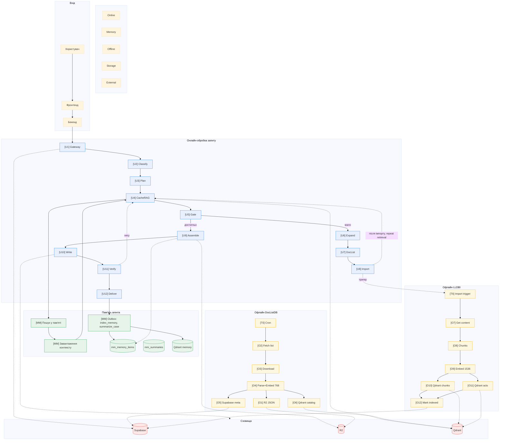
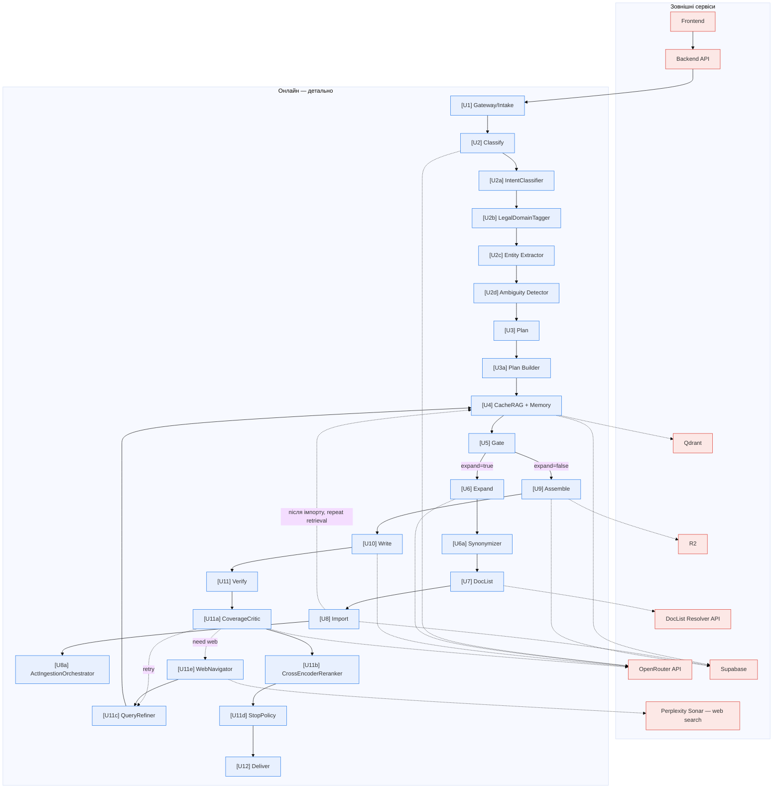
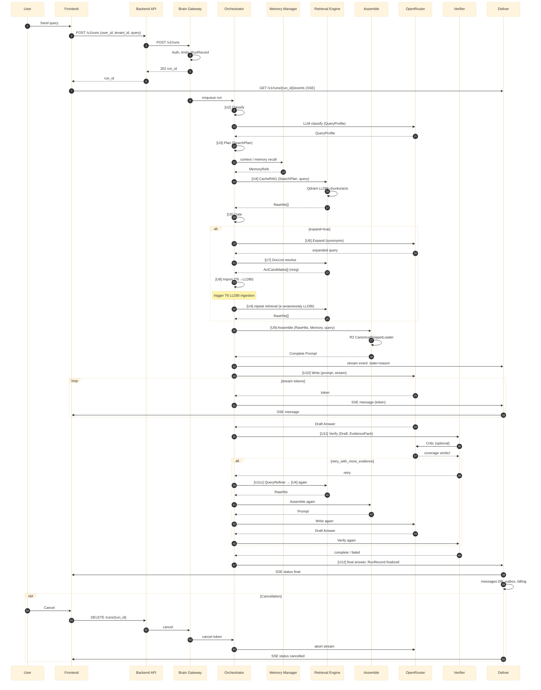
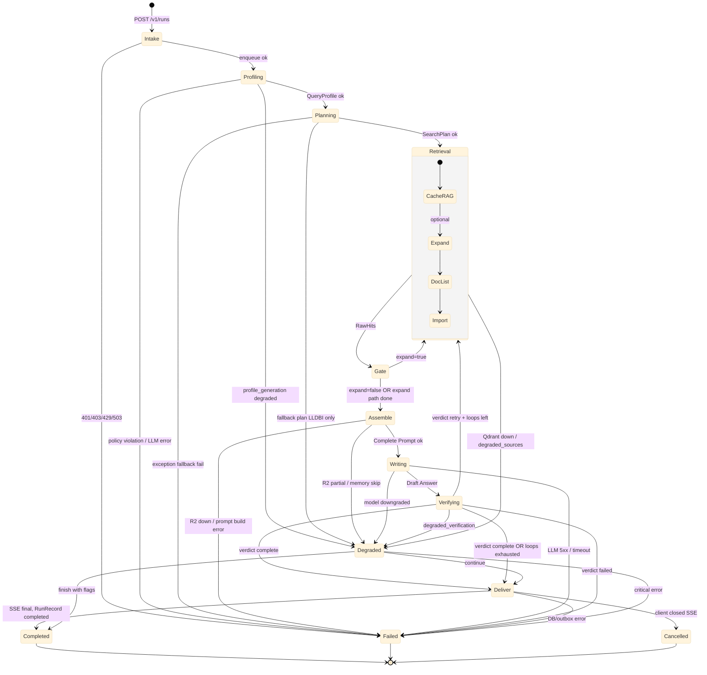
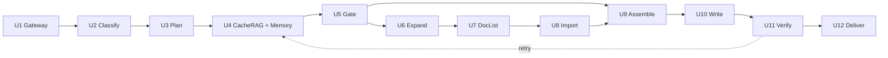
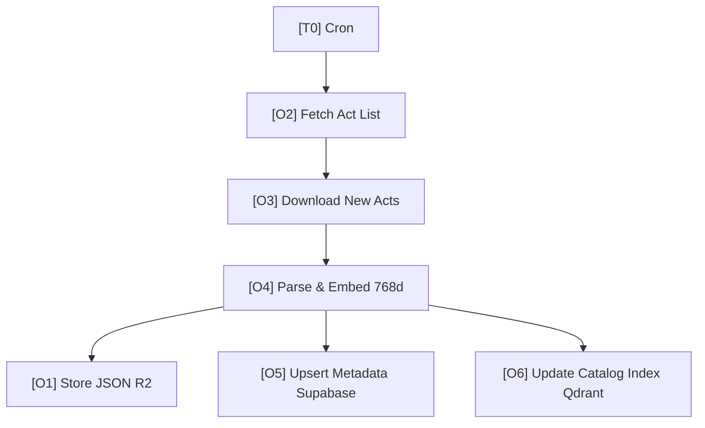
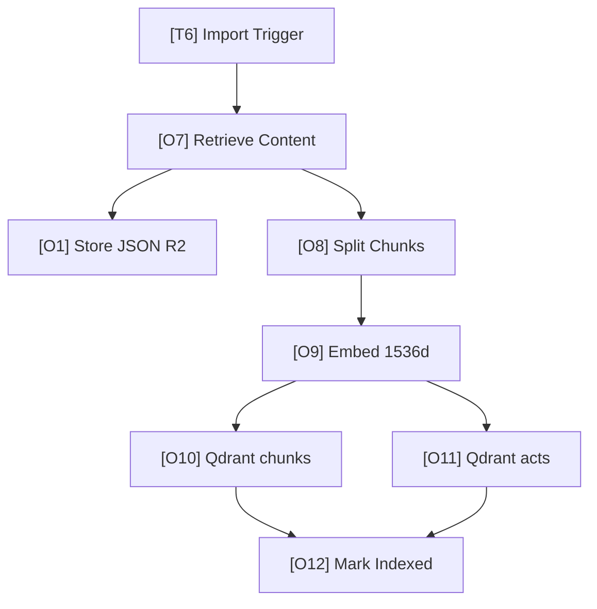

# Lexery Legal AI Agent — Повна архітектура

Єдиний архітектурний документ: що робить система, як вона влаштована, за що відповідає кожен блок (простими словами і технічно), усі пайплайни (Online, Пам’ять, DocListDB, LLDBI) та сховища. Усе в одному місці для зручного пошуку.

> **Одна велика діаграма:** [MEGA_DIAGRAM_FULL.md](./MEGA_DIAGRAM_FULL.md) — вся архітектура в одній Mermaid-діаграмі, кожен блок з простою назвою та технічним ID, усі сценарії.

---

## Зміст

1. [Простими словами: що робить агент](#1-простими-словами-що-робить-агент)
2. [Вся система одним поглядом (Mermaid)](#2-вся-система-одним-поглядом-mermaid)
   - [2.1 Детальний онлайн (підблоки)](#21-детальний-онлайн-підблоки-u2au2d-u3a-u6a-u8a-u11au11e)
   - [2.2 Діаграма послідовності (Sequence)](#22-діаграма-послідовності-sequence)
   - [2.3 Машина станів Run](#23-машина-станів-run)
3. [Пам’ять агента (Memory Manager)](#3-память-агента-memory-manager)
4. [Онлайн-пайплайн: від запиту до відповіді](#4-онлайн-пайплайн-від-запиту-до-відповіді)
5. [Офлайн-пайплайн DocListDB](#5-офлайн-пайплайн-doclistdb) — [5.2 DocList API + Import](#52-doclist-api--import-логіка-часу-під-час-run)
6. [Офлайн-пайплайн LLDBI](#6-офлайн-пайплайн-lldbi)
7. [Довідник блоків: за що відповідає кожен](#7-довідник-блоків-за-що-відповідає-кожен)
8. [Сховища та зовнішні сервіси](#8-сховища-та-зовнішні-сервіси)
9. [Стани Run та події стріму](#9-стани-run-та-події-стріму)
10. [Інваріанти та скорочення](#10-інваріанти-та-скорочення)

---

## 1. Простими словами: що робить агент

**Lexery Legal AI Agent** — це «мозок» юридичного чат-асистента. Юрист задає питання українською, а агент:

1. **Приймає запит** — перевіряє, хто ти і чи можна тобі відповідати (план, ліміти).
2. **Розуміє запит** — визначає тип питання, галузь права, згадані закони/статті.
3. **Планує пошук** — вирішує: спочатку шукати в «локальній базі законів» (LLDBI), чи одразу підтягувати каталог актів (DocList) або навіть підказки з інтернету (лише назви актів, без абзаців).
4. **Шукає докази** — у базі фрагментів законів і в **пам’яті** (що вже обговорювали, збережені факти). Якщо мало знайшлося — розширює запит синонімами, йде на **DocList API** (запит → nreg[]), імпортує відповідні акти в LLDBI і **повторює цикл пошуку** в оновленій базі.
5. **Збирає контекст** — до одного «листа» для моделі потрапляють: твій запит, останні повідомлення діалогу, витяги законів, **нотатки з пам’яті**.
6. **Генерує відповідь** — велика мовна модель пише текст тільки на основі цих доказів (без вигадок).
7. **Перевіряє відповідь** — чи все питання покрито, чи є посилання на норми. Якщо ні — може ще раз підтягнути докази і переписати.
8. **Віддає відповідь** — потоково (по частинах) і зберігає її в історію; **у фоні** оновлює пам’ять (резюме діалогу, нові факти).

**Пам’ять** — окремий шар: вона зберігає історію розмов і важливі факти по користувачу/справі; при новому запиті агент підтягує релевантне з пам’яті (в т.ч. семантичний пошук) і додає до контексту. Після кожної відповіді фоновий процес може додати нове в пам’ять (outbox: «проіндексувати пам’ять», «зробити резюме справи»).

**Офлайн** працюють два окремі потоки: (1) **DocListDB** — щодня оновлює каталог актів з офіційного джерела (назви, метадані, вектор 768d для пошуку по каталогу); (2) **LLDBI** — за потреби або за розкладом підтягує повні тексти законів, ділить їх на фрагменти, рахує вектори 1536d і кладе в пошукові індекси. Без цих потоків онлайн-пошук не мав би актуальних даних.

Далі — та сама картина, але вже з діаграмами і технічними деталями по кожному блоку.

---

## 2. Вся система одним поглядом (Mermaid)

Нижче — один великий граф: **онлайн** (від запиту до відповіді), **пам’ять** (Memory Manager, outbox, семантичний індекс), **офлайн DocListDB** (каталог актів), **офлайн LLDBI** (фрагменти законів), **сховища**. Кожна нода має ID, щоб далі швидко знайти блок у [Довіднику блоків](#7-довідник-блоків-за-що-відповідає-кожен).

**Як читати:** суцільні стрілки — основний потік; пунктир — залежності або тригери. **Пам’ять**: [U4] CacheRAG звертається до пошуку в пам’яті; [U9] Assemble підтягує контекст (історія + пам’ять); [U12] Deliver пише в outbox події типу «index_memory», «summarize_case», які потім обробляють оновлення пам’яті.

---

### 2.1 Детальний онлайн (підблоки U2a–U2d, U3a, U6a, U8a, U11a–U11e)

Нижче — повний граф онлайн-обробки з усіма підблоками та зовнішніми сервісами (OpenRouter, Qdrant, Supabase, R2, DocList Resolver, Web Search). Пам’ять інтегрована в [U4] CacheRAG (пошук у пам’яті) та [U9] Assemble (контекст з пам’яті).

**Гілки:** Gate expand=false → одразу [U9]. Gate expand=true → [U6]→[U6a]→[U7]→[U8]→[U8a]; **U8 → U4 (repeat retrieval)** → U5; при достатньо → U9. Verify retry → [U11c]→[U4]. Verify need web → [U11e]→[U11c].

---

### 2.2 Діаграма послідовності (Sequence)

Повний сценарій від запиту до відповіді з участю Memory Manager, Retrieval, Assemble, OpenRouter, Verifier, Deliver та опційним retry і скасуванням.

**Події стріму (StreamEvent):** state (classify | plan | memory | retrieve | doclist | import | reason | verify | write | deliver), message (токени), status (final | cancelled | timeout), progress, cost_so_far_usd, citations_count, mode, degrade_reason.

---

### 2.3 Машина станів Run

Життєвий цикл Run: від Intake до Completed / Failed / Cancelled / Degraded.

| Стан          | Опис                                         | RunRecord.status  |
| ------------- | -------------------------------------------- | ----------------- |
| **Intake**    | Прийом запиту, перевірка прав/лімітів        | Intake            |
| **Profiling** | [U2] Classify, QueryProfile                  | (in-memory)       |
| **Planning**  | [U3] Plan, SearchPlan                        | (in-memory)       |
| **Retrieval** | [U4] CacheRAG, опц. [U6][U7][U8]             | (in-memory)       |
| **Assemble**  | [U9] ContextPack + EvidencePack              | (in-memory)       |
| **Writing**   | [U10] Write, stream                          | drafting          |
| **Verifying** | [U11] Verify, CoverageCritic                 | (in-memory)       |
| **Deliver**   | [U12] SSE final, messages, outbox            | (finalizing)      |
| **Completed** | Успішне завершення                           | completed         |
| **Failed**    | Помилка (timeout, 5xx, policy)               | failed            |
| **Cancelled** | Користувач скасував (DELETE /runs)           | cancelled         |
| **Degraded**  | Часткова деградація (Qdrant down, no critic) | completed з flags |

---

## 3. Пам’ять агента (Memory Manager)

### 3.1 Простими словами

Пам’ять потрібна, щоб агент **не починав кожен діалог з нуля**: він знає, що ви вже обговорювали, які справи ведете, які факти підтверджені. Дані зберігаються **по користувачу і по справі/проєкту** (memory spaces), щоб контексти не змішувались.

- **При запиті:** система підтягує останні повідомлення діалогу і, за налаштуванням, робить **семантичний пошук** у пам’яті («що ми вже говорили про X») і додає знайдені нотатки/резюме в контекст для LLM.
- **Після відповіді:** у чергу (outbox) ставляться задачі: оновити **резюме діалогу** (summarize_case), **додати нові факти в пам’ять** (index_memory). Це виконується у фоні, щоб не гальмувати відповідь.

Якщо переписка дуже довга, система може **стискати** старі повідомлення в короткі резюме (конденсація), щоб не перевантажувати контекст. Пам’ять також можна **очищати** при переході на нову справу або за запитом користувача.

### 3.2 Технічно: де живе і як використовується

| Що | Де | Для чого |
|----|-----|----------|
| **Метадані пам’яті** | Supabase: `mm_memory_items`, `mm_summaries` | Нотатки, факти, резюме по user_id / conversation_id / scope. |
| **Семантичний пошук** | Qdrant: колекція `lexery_memory_semantic_v1` (або аналог) | Пошук «схожих» питань/фактів по вектору запиту. |
| **Історія діалогу** | Supabase: `messages` | Останні N повідомлень для контексту; при великих тілах — посилання на R2. |
| **Outbox** | Supabase: `mm_outbox` / `brain_outbox` | Події типу `index_memory`, `summarize_case`; воркер обробляє по черзі (з Session-ID по conversation_id), щоб уникнути гонок. |
| **R2 для пам’яті** | Префікс `tenant/{tenant_id}/mm/...` | Великі вкладення, офлоад повідомлень (за політикою). |

**Зв’язок з блоками:**

- **[U4] CacheRAG** — при пошуку, окрім LLDBI, викликає пошук у пам’яті (SQL по `mm_*` і/або векторний пошук у Qdrant memory); результат — **MemoryRefs**, які передаються далі.
- **[U9] Assemble** — читає історію (`messages`) і пам’ять (MemoryRefs + при потребі додатковий виклик до Memory Manager); формує **MemoryPack** у контексті промпту.
- **[U12] Deliver** — після успішної відповіді записує в outbox події `index_memory`, `summarize_case` тощо. Фоновий воркер зчитує outbox і виконує: індексацію нових фактів у Qdrant, генерацію/оновлення резюме в `mm_summaries`.

**Ізоляція:** у Supabase і Qdrant усі записи фільтруються по `tenant_id`, `user_id`, `scope_type`, `scope_id`, щоб дані одного клієнта/справи не потрапляли в контекст іншого.

### 3.3 Memory Manager як блок (картка)

| Поле | Значення |
|------|----------|
| **Purpose** | Довготривале зберігання контексту: нотатки, факти, резюме діалогів; семантичний пошук у пам’яті; автоматичне відновлення контексту; конденсація (стиснення старих повідомлень у резюме); очищення за запитом. |
| **Inputs** | Запит на recall: user_id, conversation_id, scope, query (для семантичного пошуку). Запит на write: події з outbox (index_memory, summarize_case). |
| **Outputs** | MemoryRefs (посилання на mm_memory_items, mm_summaries, опц. вектори з Qdrant memory); ContextPack для Assemble. |
| **Storage side-effects** | mm_memory_items, mm_summaries (Supabase); Qdrant lexery_memory_semantic_v1; outbox обробляється воркером. |
| **Dependencies** | Supabase, Qdrant (memory collection), воркер outbox (Session-ID по conversation_id). |
| **Secrets & Config** | SUPABASE_*, QDRANT_*, MEMORY_SEMANTIC_ENABLED, MEMORY_SUMMARY_LENGTH, CONTEXT_LIMIT. |
| **Failure Modes** | Пам’ять недоступна → Assemble працює без пам’яті (degraded); outbox fail → повторна спроба воркером. |

---

## 4. Онлайн-пайплайн: від запиту до відповіді

Логічний порядок кроків (деталі по кожному блоці — у [розділі 7](#7-довідник-блоків-за-що-відповідає-кожен)).

- **U1–U3:** прийом запиту, розуміння (профіль, план пошуку).
- **U4:** пошук по LLDBI і по **пам’яті**; вихід — RawHits + MemoryRefs.
- **U5:** рішення: достатньо контексту (→ U9) чи потрібно розширення (→ U6–U8).
- **U6–U8:** розширення запиту синонімами, DocList API (запит → nreg[]), імпорт актів у LLDBI (T6→O7…O12), **після імпорту — repeat retrieval U4** (пошук в оновленому LLDBI).
- **U9 Assemble:** збір повного промпту (system + user + context). **Evidence-only:** Writer бачить лише історію, пам’ять, EvidencePack (RawHits → R2 snippets).
- **U10 Write:** генерація відповіді LLM (gpt-4o) з evidence-only instruction; stream токенів в U12.
- **U11 Verify:** U11a CoverageCritic → U11b CrossEncoderReranker → U11d StopPolicy. Verdict: `complete` → U12 | `retry` → U11c → U4 | `need_web` → U11e → U11c → U4 | `failed` → U12.
- **U12 Deliver:** SSE stream (`message`, `state`, `status`), збереження messages, outbox (`index_memory`, `summarize_case`).

---

## 5. DocListDB: офлайн-пайплайн + онлайн API

**DocListDB** має дві ролі: (1) **офлайн** — оновлення каталогу; (2) **онлайн** — Act Catalog Resolver API, який [U7] викликає і отримує nreg[].

**Цикл пошуку релевантних законів (коли в LLDBI немає):** U5 (мало) → U6 Expand (синоніми) → U7 DocList API (запит → nreg[]) → U8 Import (T6→LLDBI) → **U4 repeat retrieval** → U5 → U9.

### 5.1 Офлайн-пайплайн DocListDB

Щоденне (або за розкладом) оновлення **каталогу актів**: список з Rada → завантаження карток → парсинг, embedding 768d → запис у R2, Supabase, Qdrant `legislation-catalog-index`. Каталог споживається **Act Catalog Resolver API** (POST /catalog/resolve), який [U7] викликає під час онлайн-пошуку.

**R2 для стану/логів DocListDB:** prefix `legislation/DocListDB rada gov updater log/`: `state.json`, `locks/daily.lock`, `runs/<run_id>.json`. Lock з TTL: якщо lock «молодий», повторний запуск виходить з кодом 0 без роботи.

### 5.2 DocList API + Import: логіка часу під час Run

DocList API (U7) і подальший імпорт кандидатів у LLDBI (U8→T6→O7…O12) можуть займати **багато часу**. Мінімальна логіка:

| Етап | Орієнтовний час | Опис |
|------|-----------------|------|
| **U7 DocList API** | ~1–5 с | POST /catalog/resolve — швидко |
| **T6→O7…O12 (один акт)** | ~30 с – 2 хв | fetch Rada, parse, chunk, embed, upsert Qdrant |
| **Повний імпорт 5–10 актів** | 3–15 хв | Неприйнятно чекати в одному Run |

**Стратегія (рекомендована):**

1. **Fast mode:** чекати лише top 1–3 акти (config `IMPORT_FAST_MODE_COUNT`), timeout ~15–30 с на весь етап.
2. Решта кандидатів — **в чергу** (import_jobs), імпорт у фоні.
3. Після timeout або успішного імпорту top-N → **U4 repeat retrieval** з тим, що встигло проіндексуватись.
4. SSE події: `doclist`, `import_start`, `import_waiting`, `import_done` / `import_timeout`.

**Режими:**

- **fast** — чекати 1–3 акти, потім U4 repeat.
- **queue_only** — не чекати, тільки enqueue; U4 repeat з тим, що є (можливо порожньо для нових актів).
- **degraded** — при timeout: `degrade_reason: import_timeout`, відповідь з наявним контекстом + «рекомендую перевірити пізніше» для актів у черзі.

**U8a ActIngestionOrchestrator** вирішує, **які акти імпортувати першими** (див. підблок [U8a] у секції 7).

---

## 6. Офлайн-пайплайн LLDBI

Імпорт **повних текстів** актів у пошукову базу: отримання контенту (R2 або Rada) → збереження canonical JSON у R2 → розбиття на чанки → embedding 1536d → запис у Qdrant (`lexery_legislation_chunks`, `lexery_legislation_acts`) та оновлення статусу в Supabase.

Тригер [T6] може приходити з [U8] Import (коли під час відповіді виявили акт, якого ще нема в LLDBI) або з адмін-черги/завдань.

---

## 7. Довідник блоків: за що відповідає кожен

Для кожного блоку: **простими словами**, **призначення**, **входи/виходи**, **куди веде**, **залежності** (коротко). Секрети, таймаути, тести — у попередніх окремих матрицях (наприклад `docs/architecture/mermaid/07_BLOCK_CARDS.md`); тут — орієнтир для навігації.

---

### Онлайн

| ID | Простими словами | Призначення | Входи | Виходи | Куди веде |
|----|------------------|-------------|-------|--------|-----------|
| **[U1] Gateway** | «Вхідні двері»: приймає запит, перевіряє права і ліміти. | Прийом POST /v1/runs, валідація, створення RunRecord, постановка в чергу. | user_id, tenant_id, текст запиту, налаштування. | run_id, RunRecord (Intake). | [U2] Classify. |
| **[U2] Classify** | Визначає: тип питання, галузь права, згадані акти/статті, чи є неоднозначність. | Побудова QueryProfile і RoutingFlags для планувальника і пошуку. | Текст запиту, метадані. | QueryProfile, RoutingFlags. | [U3] Plan. |
| **[U3] Plan** | Вирішує, де шукати: тільки LLDBI, чи ще каталог (DocList), чи веб-підказки. | SearchPlan, RoutingFlags (need_deep_retrieval, need_web). | QueryProfile, feature flags. | SearchPlan. | [U4] CacheRAG. |
| **[U4] CacheRAG** | Шукає фрагменти законів у LLDBI і **релевантне в пам’яті** користувача. | Векторний пошук по chunks/acts + пошук у пам’яті (mm_*, Qdrant memory). | SearchPlan, запит, refs з U2. | RawHits[], MemoryRefs. | [U5] Gate. |
| **[U5] Gate** | Перевіряє: чи достатньо знайденого, чи треба розширювати пошук (DocList/Import). | Рішення expand=true/false. | RawHits[], QueryProfile. | expand, reason. | Якщо достатньо → [U9]; інакше → [U6]. |
| **[U6] Expand** | Доповнює запит синонімами і юридичними термінами для пошуку по каталогу. | Розширений запит для DocList. | Запит, флаги з Gate. | Expanded query. | [U7] DocList. |
| **[U7] DocList** | Викликає DocList Resolver API: запит → список nreg[] (ActCandidates). | POST /catalog/resolve, векторний пошук legislation-catalog-index (768d). | Expanded query з [U6]. | ActCandidates[] (nreg, dokid, nazva). | [U8] Import. |
| **[U8] Import** | Імпортує обрані акти в LLDBI (T6→O7…O12), потім **repeat retrieval** — повертає управління в [U4]. | Тригер [T6]; при потребі синхронне чекання 1–3 актів. | ActCandidates[], [U8a] пріоритизація, [U8b] валідація (top 3 або 1 найкращий). | Оновлений LLDBI. | **U4** (repeat retrieval) → U5 → U9. |
| **[U9] Assemble** | Збирає промпт: system (evidence-only інструкції), user, context (історія + пам’ять + EvidencePack з R2). | Формування system/user/context блоків для LLM; Writer бачить лише підтверджений контекст. | RawHits, MemoryRefs, messages, запит. | Complete Prompt. | [U10] Write. |
| **[U10] Write** | Викликає LLM (gpt-4o), отримує відповідь (evidence-only instruction у промпті). | Генерація відповіді тільки з наданого контексту; stream токенів в U12. | Complete Prompt, вибір моделі. | Draft Answer, stream. | [U11] Verify. |
| **[U11] Verify** | U11a CoverageCritic → U11b CrossEncoderReranker → U11d StopPolicy. Verdict: complete / retry / need_web / failed. | Rerank, CoverageCritic, StopPolicy; (опц.) retry (U11c→U4) або need_web (U11e→U11c→U4). | Draft Answer, EvidencePack, QueryProfile. | Verdict, (опц.) retry до U4. | [U12] Deliver. |
| **[U12] Deliver** | Віддає відповідь клієнту потоково (SSE), зберігає messages, **outbox** (index_memory, summarize_case). | SSE події (`message`, `state`, `status`), RunRecord completed/failed. | Verified answer, run_id. | Stream, фінальний статус. | Клієнт; фоновий воркер outbox. |

---

### Підблоки онлайн (U2a–U2d, U3a, U6a, U8a, U8b, U11a–U11e)

| ID | Простими словами | Технічно |
|----|------------------|----------|
| **[U2a] IntentClassifier** | Визначає тип питання (intent). | Входи: текст запиту. Виходи: intent. Залежності: LLM або rules. |
| **[U2b] LegalDomainTagger** | Визначає галузь права (domain). | Входи: текст запиту / QueryProfile. Виходи: domain. |
| **[U2c] Entity Extractor** | Витягує з запиту згадки актів і статей (entities). | Входи: текст запиту. Виходи: entities. |
| **[U2d] Ambiguity Detector** | Визначає ознаки неоднозначності запиту. | Входи: текст запиту, QueryProfile. Виходи: routing_flags.ambiguous. |
| **[U3a] Plan Builder** | Будує кроки пошуку: LLDBI, DocList, Web (Legal Navigator build_plan). | Входи: QueryProfile, pinned_acts, constraints. Виходи: SearchPlan (кроки). Залежності: DirectCitationsResolver, LLDBI_ActIndex, DocListDB.resolve. |
| **[U6a] Synonymizer** | Генерує синоніми та переформулювання для пошуку по каталогу. | Входи: user_query, QueryProfile. Виходи: ExpandedQuery / синоніми. Залежності: LLM. |
| **[U8a] ActIngestionOrchestrator** | Вирішує **які акти імпортувати першими**: (1) фільтр Missing — виключити акти з qdrant_status=indexed; (2) rank за DocList score + boost entities з QueryProfile; (3) pick top N (IMPORT_FAST_MODE_COUNT) для синхронного чекання; (4) решта → queue (import_jobs). | Входи: ActCandidates, constraints (latency/budget). Виходи: [immediate[], queued[]], enqueue ImportQueue. Залежності: Supabase legislation_documents, job runner. |
| **[U8b] ActRelevanceValidator** | Валідація top 3 перед Import: confidence ≥70–80% → імпорт top 3. Інакше → Web (Perplexity Sonar) enrichment → re-rank → імпорт 1 найкращий. **Fallback:** якщо Web fail (немає інфи, ліміт) → імпорт top 3. | Модель: perplexity/sonar (OPENROUTER_API_KEY_WEB) — вміє залазити в інтернет. Залежності: gpt-4o-mini (confidence), perplexity/sonar (Web). |
| **[U11a] CoverageCritic** | Перевіряє покриття аспектів запиту (підстава, процедура, наслідки); verdict: complete / retry / need_web / failed. | Модель: gpt-4o-mini. Виходи: verdict, missing aspects. |
| **[U11b] CrossEncoderReranker** | Перевіряє цитати (чи extracts відповідають EvidencePack); фільтрує «придумані» цитати. | Модель: ms-marco-MiniLM-L-6-v2 (локально). |
| **[U11c] QueryRefiner** | Формує refined query для retry retrieval; додає missing aspects, опц. WebHints. | Модель: gpt-4o-mini. Використовується при retry: U11 → U11c → U4. |
| **[U11d] StopPolicy** | Обмежує ітерації retry (VERIFIER_MAX_LOOPS), бюджет, час; stop / continue. | Rules. Config: VERIFIER_MAX_LOOPS, MAX_RETRIEVAL_BUDGET_USD. |
| **[U11e] WebNavigator** | Повертає лише WebHints (назви актів, ключові слова), без абзаців для Writer. | Виходи: candidate_act_titles, keywords. Залежності: **Perplexity Sonar** (`perplexity/sonar`) via OpenRouter — модель з вбудованим веб-пошуком. |

Детальні 11 полів (Purpose, Inputs, Outputs, Storage, Dependencies, Secrets, Failure Modes, Retries, Observability, Test Hooks) для кожного блоку — у файлі `docs/architecture/mermaid/07_BLOCK_CARDS.md`.

---

### Пам’ять (в контексті онлайн)

| Що | Простими словами | Технічно |
|----|------------------|----------|
| **Завантаження контексту** | Підтягування історії діалогу і релевантних нотаток з пам’яті для Assemble. | Читання `messages`, MemoryRefs з U4; опц. додатковий виклик до mm_* / Qdrant memory. |
| **Пошук у пам’яті** | Частина [U4]: семантичний і/або SQL по пам’яті. | Qdrant `lexery_memory_semantic_v1`, Supabase `mm_memory_items`, `mm_summaries`. |
| **Outbox після Deliver** | Фонове оновлення пам’яті: додати нові факти, оновити резюме справи. | Події `index_memory`, `summarize_case` у mm_outbox; воркер з Session-ID по conversation_id. |

---

### Офлайн DocListDB

| ID | Простими словами | Призначення | Куди веде |
|----|------------------|-------------|-----------|
| **[T0]** | За розкладом запускає оновлення каталогу. | Cron / Azure Timer. | [O2]. |
| **[O2]** | Отримує список нових/змінених актів з Rada. | Fetch Act List. | [O3]. |
| **[O3]** | Завантажує сирі картки/тексти. | Download New Acts. | [O4]. |
| **[O4]** | Парсить в canonical JSON, рахує embedding 768d. | Parse & Gen Embeddings. | [O1], [O5], [O6]. |
| **[O1]** | Зберігає canonical JSON у R2. | Store Canonical JSON. | — |
| **[O5]** | Додає/оновлює метадані в Supabase. | Upsert Metadata. | — |
| **[O6]** | Додає вектор у Qdrant legislation-catalog-index. | Update Catalog Index. | — |

---

### Офлайн LLDBI

| ID | Простими словами | Призначення | Куди веде |
|----|------------------|-------------|-----------|
| **[T6]** | Отримує завдання «імпортуй акт X» (з U8 або черги). | Import Job Trigger. | [O7]. |
| **[O7]** | Бере текст акта з R2 або Rada; при потребі зберігає в R2. | Retrieve Act Content. | [O1], [O8]. |
| **[O8]** | Ділить акт на фрагменти (чанки). | Split into Chunks. | [O9]. |
| **[O9]** | Рахує embedding 1536d для чанків і акту. | Embed Chunks. | [O10], [O11]. |
| **[O10]** | Записує вектори чанків у lexery_legislation_chunks. | Update Chunk Index. | [O12]. |
| **[O11]** | Записує вектор акту в lexery_legislation_acts. | Update Act Index. | [O12]. |
| **[O12]** | Позначає в Supabase, що акт проіндексований. | Mark Indexed. | — |

---

## 8. Сховища та зовнішні сервіси

| Що | Призначення | Використовують блоки |
|----|-------------|----------------------|
| **Supabase** | RunRecord, messages, пам’ять (mm_memory_items, mm_summaries), legislation_documents, legislation_import_jobs, outbox, billing_ledger. | U1, U4, U8, U9, U12; O5, O12; T6; Memory. |
| **R2** | Canonical JSON актів (legislation/...), стани/логи DocListDB (prefix `legislation/DocListDB rada gov updater log/`), великі вкладення/офлоад (tenant/.../mm/...). | U9 (snippets), U12 (офлоад); O1; O7. |
| **Qdrant** | lexery_legislation_chunks (1536d), lexery_legislation_acts (1536d), legislation-catalog-index (768d), колекція пам’яті (semantic). | U4 (LLDBI + memory); U7 (catalog); O6, O10, O11; Memory. |
| **OpenRouter** | LLM для Classify, Expand, Write, Verify (Critic). | U2, U6, U10, U11. |
| **Rada** | Список актів, картки, тексти. | O2, O3; O7. |
| **DocList Resolver API** | POST /catalog/resolve — пошук по каталогу, повертає nreg[]. | U7 (DocList). |
| **Perplexity Sonar API** | `perplexity/sonar` via OpenRouter — модель з вбудованим веб-пошуком. Повертає результати з citations. | U8b (Web enrichment), U11e (WebNavigator). |

---

## 9. Стани Run та події стріму

Повна машина станів і таблиця станів — у [розділі 2.3](#23-машина-станів-run).

**Стани Run (коротко):** Intake → Profiling (Classify) → Planning → Retrieval (CacheRAG, опц. Expand/DocList/Import) → Assemble → Writing → Verifying → Deliver → **Completed** / **Failed** / **Cancelled**. Можливий стан **Degraded** (часткова деградація сервісів при збереженій відповіді).

**Події стріму (SSE):** `state` (classify, plan, memory, retrieve, doclist, import, reason, verify, write, deliver), `message` (токени відповіді), `status` (final, cancelled, timeout), `progress`, `cost_so_far_usd`, `citations_count`, `mode`, `degrade_reason`.

---

## 10. Інваріанти та скорочення

- **Evidence-only:** Writer/Reasoner використовують лише EvidencePack + підтверджений контекст (Memory); без джерела — припущення або заборона.
- **Web = тільки підказки:** веб-модуль (Perplexity Sonar) повертає лише WebHints (назви актів, терміни); Writer не бачить сирий веб-контент.
- **Caps:** max_total_cost_usd, max_llm_calls, max_retrieval_loops, max_tokens_out — при досягненні graceful degrade.
- **Provenance:** кожен фрагмент з актів має source_id, content_hash, r2_key, json_path, snippet_id.

**Скорочення:** LLDBI = Lexery Legislation DB (фрагменти законів); DocListDB = каталог актів (метадані + 768d); Rada = офіційне джерело; MM = Memory Manager; Run = один цикл обробки запиту; EvidencePack = набір витягів норм з джерелами; MemoryPack = контекст з пам’яті для промпту.

---

*Цей документ об’єднує опис архітектури з plan.md, answer.md та mermaid-діаграм у docs/architecture/mermaid/. Для детальних полів блоків (секрети, таймаути, тести) див. 07_BLOCK_CARDS.md.*
