# Lexery Legal AI Agent — Current Full Architecture

Єдина повна схема поточного runtime. Документ відображає **факти по коду і перевірках**, а не стару planned-only модель.

---

## ⚡ Швидка довідка

| Що | Поточна реальність |
|----|---------------------|
| **Основний online path** | `U1 -> U2 -> U3 -> U4 -> U5 -> U9 -> U10 -> U11 -> U12` |
| **Durable runtime** | Redis Streams queue + Redis RunContext store, idempotent U11/U12 claims |
| **Retrieval evidence** | U4 LLDBI + memory, compact retrieval trace у DB, full retrieval trace у R2 |
| **Generation** | U9 assemble (`law + docs + memory + history`) -> U10 Prompt Stack / Evidence Triage / Focus Spec / Output Validator |
| **Verify** | U11 зараз scaffold (`complete` / `failed`) з durable `verify_result`; повний critic-loop ще planned |
| **Memory** | MM outbox, semantic memory, source summary, isolation/runtime checks |
| **MM Docs** | ingest + retrieve + scope isolation, snippets йдуть у U9 |
| **Supabase** | 2 проєкти: `Lexery DB` + `Legislation DB` |
| **R2** | 2 buckets: `lexery-legal-agent` + `legislation` |
| **Qdrant** | Legislation cluster + Lexery-LA cluster; MM Docs за замовчуванням можуть ділити Lexery-LA cluster з memory |
| **OpenRouter keys** | Єдиний Brain key family: `OPENROUTER_API_KEY_BRAIN > OPENROUTER_API_KEY_ONLINE` |

---

## 📖 Як читати

| Елемент | Значення |
|---------|----------|
| 🔵 **Сині** | Онлайн runtime стадії |
| 🟢 **Зелені** | Memory / MM Docs підсистеми |
| 🟠 **Помаранчеві** | Офлайн legislation ingestion |
| 🔴 **Рожеві** | Сховища |
| 🟣 **Фіолетові** | API / external infra |
| 🟦 **Блакитні** | Durable runtime інфраструктура |
| ⚪ **Сірі** | User / frontend / backend |
| **Пунктирні сірі** | Planned / future, але не current runtime |

---

## 🗺️ Діаграма

```mermaid
%%{init: {"flowchart":{"curve":"basis","padding":32,"nodeSpacing":55,"rankSpacing":62},"theme":"base","themeVariables":{"darkMode":"true","background":"#0d0d12","primaryTextColor":"#e4e4e7","primaryBorderColor":"#3f3f46","lineColor":"#52525b","secondaryColor":"#18181b","secondaryTextColor":"#a1a1aa","tertiaryColor":"#27272a","mainBkg":"#18181b","secondBkg":"#0f0f12","tertiaryBkg":"#09090b","textColor":"#d4d4d8","fontSize":"12px","fontFamily":"'SF Pro Display', system-ui, -apple-system, sans-serif","clusterBkg":"#18181b","clusterBorder":"#27272a","titleColor":"#fafafa","edgeLabelBackground":"#27272a","nodeBorder":"#3f3f46"}} }%%
flowchart TB
  subgraph EXT["🌐 Зовнішній світ"]
    USR["👤 Користувач"]
    FE["🖥️ Фронтенд"]
    BE["⚙️ Бекенд / Product API"]
  end

  subgraph DUR["🧱 Durable Runtime"]
    direction TB
    RQ["Redis Streams Queue<br/>────────────────<br/>run_events / retry / dlq<br/>[gateway/queue-redis]"]
    RC["Redis RunContext Store<br/>────────────────<br/>TTL snapshots / assembled state<br/>[lib/run-context-redis]"]
  end

  subgraph ONLINE["📡 Online Runtime"]
    direction TB

    subgraph INTAKE["1️⃣ Intake & Routing"]
      U1["[U1] Gateway<br/>────────────────<br/>HTTP intake, auth/dev gate,<br/>persist run, enqueue"]
      U2["[U2] Classify<br/>────────────────<br/>query profile, legal domain,<br/>ambiguity, routing flags<br/>🤖 Brain LLM"]
      U3["[U3/U3a] Plan<br/>────────────────<br/>SearchPlan, thresholds,<br/>use_lldbi / use_memory / use_doclist"]
    end

    subgraph RETR["2️⃣ Retrieval & Gate"]
      U4["[U4] CacheRAG<br/>────────────────<br/>LLDBI retrieval + memory hooks<br/>🤖 Brain embeddings"]
      U4A["[U4a] Trace Persist<br/>────────────────<br/>compact trace -> DB<br/>full trace -> R2"]
      U5["[U5] Gate<br/>────────────────<br/>expand=false / true,<br/>degrade-aware rules"]
      U6["[U6] Expand<br/>────────────────<br/>stub / expansion path"]
      U7["[U7] DocList<br/>────────────────<br/>catalog resolve / missing acts<br/>🤖 Brain embeddings"]
      U8["[U8] Import / Repeat Retrieval<br/>────────────────<br/>legislation ingest trigger,<br/>then U4 repeat"]
    end

    subgraph GEN["3️⃣ Assemble / Write / Deliver"]
      U9D["[U9a] MM Docs Context<br/>────────────────<br/>ingest + retrieve + scope isolation"]
      U9["[U9] Assemble<br/>────────────────<br/>system + user + law/docs/<br/>memory/history"]
      U10A["[U10a] Prompt Stack<br/>────────────────<br/>global -> project -> chat -> user"]
      U10B["[U10b] Evidence Triage<br/>────────────────<br/>snippet reduction / ordering<br/>🤖 Brain LLM"]
      U10C["[U10c] Focus Spec<br/>────────────────<br/>task type, primary norm,<br/>law cap"]
      U10M["[U10m] Memory Search<br/>────────────────<br/>optional fallback/tool path"]
      U10["[U10] Write<br/>────────────────<br/>Legal Agent answer generation<br/>🤖 configured Brain model"]
      U10D["[U10d] Output Validator<br/>────────────────<br/>guardrails / formatting / sanity"]
      U11["[U11] Verify Scaffold<br/>────────────────<br/>durable verdict from llm_result"]
      U11F["Future verify loop<br/>────────────────<br/>CoverageCritic / Reranker / WebNavigator"]
      U12["[U12] Deliver<br/>────────────────<br/>messages, source_summary,<br/>outbox, complete_run"]
    end
  end

  subgraph MEMORY["🧠 Memory / MM Docs"]
    direction TB
    MM_SEARCH["[MM] Search<br/>────────────────<br/>semantic memory retrieval<br/>🤖 Brain embeddings"]
    MM_LOAD["[MM] Load<br/>────────────────<br/>summaries + items -> RunContext"]
    MM_OUTBOX["[MM] Outbox Worker<br/>────────────────<br/>index_memory / summarize_case<br/>🤖 Brain LLM + embeddings"]
    MM_DOC_DB[("mm_doc_records / ingest_log")]
    MM_MEM_DB[("mm_memory_items / mm_summaries / mm_outbox")]
  end

  subgraph DOCLIST["📋 DocListDB / Catalog"]
    direction LR
    T0["[T0] Cron"]
    O2["[O2] Fetch metadata"]
    O3["[O3] Download"]
    O4["[O4] Parse & Embed<br/>🤖 Brain embeddings"]
    O5["[O5] Store catalog meta"]
    O6["[O6] Catalog index upsert"]
  end

  subgraph LLDBI["📚 LLDBI Ingestion"]
    direction LR
    T6["[T6] Trigger"]
    O7["[O7] Fetch content"]
    O8["[O8] Parse chunks"]
    O9["[O9] Embed chunks<br/>🤖 Brain embeddings"]
    O10["[O10] Upsert chunks"]
    O11["[O11] Upsert acts"]
    O12["[O12] Mark indexed"]
  end

  subgraph SB["🗄️ Supabase"]
    SB_LEXERY[("Lexery DB<br/>runs, messages,<br/>mm_* , mm_doc_*")]
    SB_LEG[("Legislation DB<br/>legislation_documents,<br/>catalog/import metadata")]
  end

  subgraph R2B["🗄️ R2 Buckets"]
    R2_RUNS[("lexery-legal-agent<br/>retrieval traces,<br/>MM docs, MM offload")]
    R2_LEG[("legislation<br/>canonical acts,<br/>catalog artifacts")]
  end

  subgraph QDS["🗄️ Qdrant"]
    QD_CHUNKS[("lexery_legislation_chunks")]
    QD_ACTS[("lexery_legislation_acts")]
    QD_CAT[("legislation-catalog-index")]
    QD_MEM[("lexery_memory_semantic_v1")]
    QD_DOCS[("lexery_mm_docs_chunks_v1")]
  end

  subgraph API["🔑 APIs / External Infra"]
    K_BRAIN["OpenRouter Brain key family<br/>OPENROUTER_API_KEY_BRAIN<br/>fallback -> OPENROUTER_API_KEY_ONLINE"]
    RADA["Rada.gov.ua API"]
    DOCL["DocList Resolver API"]
  end

  USR --> FE --> BE --> U1
  U1 --> RQ --> U2 --> U3 --> U4
  U1 --> RC
  U2 -.-> RC
  U3 -.-> RC
  U4 --> MM_SEARCH --> MM_LOAD --> U4
  U4 --> U4A --> U5
  U4 -.-> RC
  U5 -->|enough evidence| U9D --> U9
  U5 -->|expand / degraded path| U6 --> U7 --> U8
  U8 -.->|repeat retrieval| U4
  U9 -.-> RC
  U9 --> U10A --> U10B --> U10C --> U10
  U10C -.-> U10M -.-> U10
  U10 --> U10D --> U11 --> U12
  U11 -.-> U11F
  U10 -.-> RC
  U11 -.-> RC
  U12 --> MM_OUTBOX

  T0 --> O2 --> O3 --> O4 --> O5
  O4 --> O6
  T6 --> O7 --> O8 --> O9 --> O10
  O9 --> O11
  O10 --> O12
  O11 --> O12

  U1 -.-> SB_LEXERY
  U4 -.-> QD_CHUNKS
  U4 -.-> QD_ACTS
  U4 -.-> QD_MEM
  U4A -.-> SB_LEXERY
  U4A -.-> R2_RUNS
  U7 -.-> DOCL
  U7 -.-> SB_LEG
  U7 -.-> QD_CAT
  U8 -.-> SB_LEG
  U9D -.-> MM_DOC_DB
  U9D -.-> QD_DOCS
  U9D -.-> R2_RUNS
  U9 -.-> R2_LEG
  U9 -.-> SB_LEXERY
  U10 -.-> SB_LEXERY
  U11 -.-> SB_LEXERY
  U12 -.-> SB_LEXERY
  MM_OUTBOX -.-> MM_MEM_DB
  MM_OUTBOX -.-> QD_MEM
  MM_OUTBOX -.-> R2_RUNS
  MM_DOC_DB -.-> SB_LEXERY
  MM_MEM_DB -.-> SB_LEXERY
  O5 -.-> SB_LEG
  O6 -.-> QD_CAT
  O7 -.-> R2_LEG
  O10 -.-> QD_CHUNKS
  O11 -.-> QD_ACTS
  O12 -.-> SB_LEG

  U2 -.-> K_BRAIN
  U4 -.-> K_BRAIN
  U7 -.-> K_BRAIN
  U9D -.-> K_BRAIN
  U10B -.-> K_BRAIN
  U10 -.-> K_BRAIN
  U10M -.-> K_BRAIN
  MM_SEARCH -.-> K_BRAIN
  MM_OUTBOX -.-> K_BRAIN
  O4 -.-> K_BRAIN
  O9 -.-> K_BRAIN
  O2 -.-> RADA
  O3 -.-> RADA
  O7 -.-> RADA

  classDef online fill:#1e3a5f,stroke:#3b82f6,stroke-width:2px,color:#e0f2fe
  classDef memory fill:#0f3d2e,stroke:#22c55e,stroke-width:2px,color:#dcfce7
  classDef offline fill:#3d2e0f,stroke:#f59e0b,stroke-width:2px,color:#fef3c7
  classDef storage fill:#3d1e2e,stroke:#ec4899,stroke-width:2px,color:#fce7f3
  classDef api fill:#2e1f4d,stroke:#a855f7,stroke-width:2px,color:#f3e8ff
  classDef external fill:#27272a,stroke:#71717a,stroke-width:2px,color:#fafafa
  classDef durable fill:#12374a,stroke:#38bdf8,stroke-width:2px,color:#e0f2fe
  classDef future fill:#1f2937,stroke:#94a3b8,stroke-width:2px,color:#e2e8f0,stroke-dasharray: 5 5

  class U1,U2,U3,U4,U4A,U5,U6,U7,U8,U9D,U9,U10A,U10B,U10C,U10M,U10,U10D,U11,U12 online
  class MM_SEARCH,MM_LOAD,MM_OUTBOX,MM_DOC_DB,MM_MEM_DB memory
  class T0,O2,O3,O4,O5,O6,T6,O7,O8,O9,O10,O11,O12 offline
  class SB_LEXERY,SB_LEG,R2_RUNS,R2_LEG,QD_CHUNKS,QD_ACTS,QD_CAT,QD_MEM,QD_DOCS storage
  class K_BRAIN,RADA,DOCL api
  class USR,FE,BE external
  class RQ,RC durable
  class U11F future
```

<div style="background: linear-gradient(180deg, #0d0d12 0%, #141419 100%); padding: 2rem; border-radius: 16px; margin: 1.5rem 0; border: 1px solid #27272a;">



</div>

---

## 🧭 Current runtime by stage

### U1-U5

- `U1` приймає run, зберігає durable state, штовхає подію в Redis queue.
- `U2` формує query profile.
- `U3` будує SearchPlan.
- `U4` виконує legislation retrieval і memory hooks.
- `U4a` зберігає compact/full retrieval trace.
- `U5` вирішує, чи вистачає evidence, чи йти в expansion/degraded path.

### U6-U8

- `U6` лишається частково реалізованим expansion path.
- `U7/U8` покривають doclist/import/repeat retrieval сценарій, але це не головний стабільний runtime path.

### U9-U12

- `U9a` додає MM Docs context.
- `U9` складає evidence-only prompt з каналів `law + docs + memory + history`.
- `U10` уже не один LLM-call, а стек із `Prompt Stack`, `Evidence Triage`, `Focus Spec`, `Memory Search`, `Output Validator`.
- `U11` поки тільки verdict scaffold з durable `verify_result`.
- `U12` робить idempotent deliver, source summary patch, MM outbox enqueue і завершення run.

---

## 🗄️ Поточна storage / infra matrix

### Supabase

| Проєкт | Що зберігає | Хто використовує |
|--------|-------------|------------------|
| **Lexery DB** | `runs`, `messages`, `mm_memory_items`, `mm_summaries`, `mm_outbox`, `mm_doc_records`, `mm_doc_ingest_log` | U1, U4a, U9, U10, U11, U12, MM, MM Docs |
| **Legislation DB** | catalog/import metadata, legislation tables | U7, U8, offline ingestion |

### R2

| Bucket | Призначення |
|--------|-------------|
| **`legislation`** | canonical legislation artifacts, catalog/offline ingestion payloads |
| **`lexery-legal-agent`** | retrieval traces, MM Docs payloads, MM offload/runtime artifacts |

### Qdrant

| Collection | Призначення |
|-----------|-------------|
| `lexery_legislation_chunks` | U4 retrieval / LLDBI chunks |
| `lexery_legislation_acts` | U4 act-level retrieval |
| `legislation-catalog-index` | U7 DocList/catalog lookup |
| `lexery_memory_semantic_v1` | MM semantic memory |
| `lexery_mm_docs_chunks_v1` | MM Docs semantic retrieval |

### Redis

| Layer | Призначення |
|------|-------------|
| **Redis Streams queue** | main / retry / dlq event transport |
| **Redis RunContext** | cross-stage assembled state, TTL snapshots |

---

## 🔑 Key / model policy

- Поточний runtime не використовує окрему live `WEB` key family.
- Brain LLM/embedding виклики йдуть через precedence:

```bash
OPENROUTER_API_KEY_BRAIN > OPENROUTER_API_KEY_ONLINE
```

- Це стосується і writer/classifier, і embedding-based Brain викликів.
- Поточний U10 baseline у цьому dirty-tree: configured Brain model, під час dry-run/verification спостерігався `openai/gpt-5.2`.

---

## 📌 Current vs planned

### Current runtime

- Redis durable queue/context
- U4 trace persistence
- MM Docs ingest/retrieve
- U9 multi-channel assemble
- U10 internal prompt/evidence pipeline
- U11 scaffold
- U12 durable deliver + MM outbox

### Planned / not yet current

- повний U11 critic/rerank/web retry loop;
- deeper cleanup великих runtime-модулів;
- окремі quality improvements у U10 response generation.

---

## 📐 Експорт

```bash
npx @mermaid-js/mermaid-cli -i docs/architecture/MEGA_DIAGRAM_FULL.md -o docs/architecture/mega.svg
```
